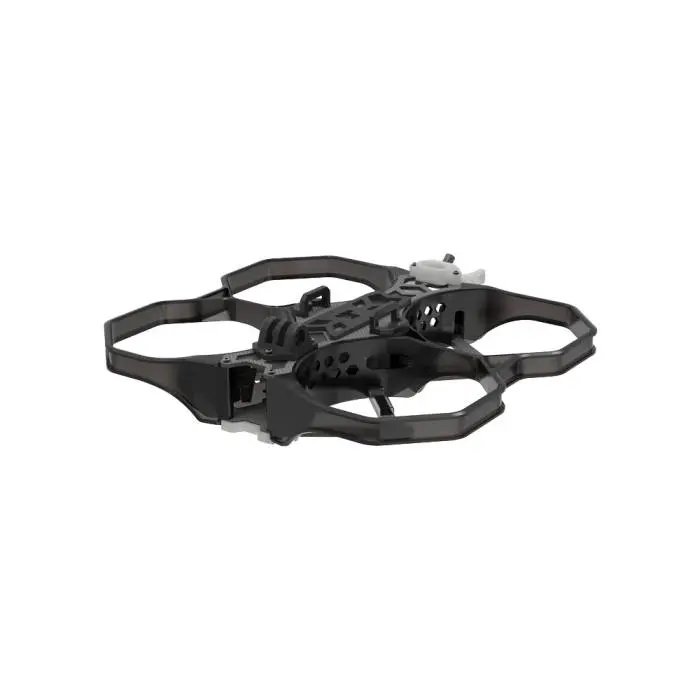

This page contains details about building the frame used for the Drone.

# YouTube Video
- [Let’s Build an FPV Drone – Part 2 Frame Assembly](https://youtu.be/4hs_yXV46YM)

# Build Notes
- Make sure you get 12mm motors so that they will mount properly to the frame.
- You can 3d print taller landing arm mounts: [iFlight Protek 35 - Landing-Train / Landing-Train](https://cults3d.com/en/3d-model/various/iflight-protek-35-landing-train-aterrizaje-tren)

# Pictures

