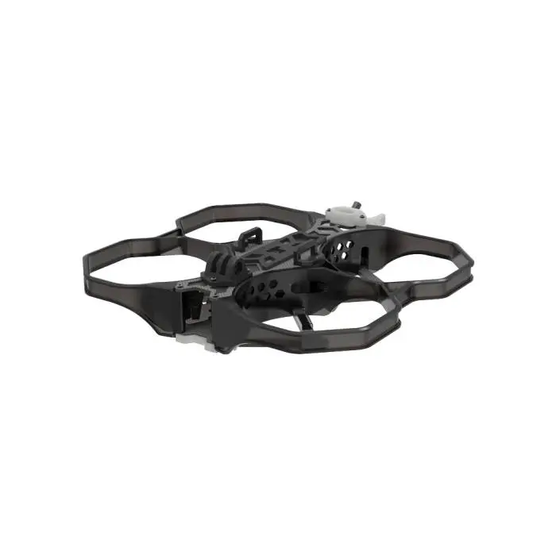

Welcome to the 3.5" FPV Drone Build Project! This time, I’ll be putting together a compact cinewhoop designed for speed, agility, and high-quality video capture. Built around the iFlight Protek 35 V1.4 frame, this drone will feature a powerful MicroAir743 V2 AM32 flight controller and ESC stack running ArduPilot firmware, paired with a MicroAir M9/M10 GPS for precise navigation. For control and reliability, I’ll be using a RadioMaster ELRS transmitter/receiver, while HDZero Goggle 2 and a RunCam Phoenix 2 Nano camera will provide crystal-clear FPV footage.

The build will also include TBS’s Unify Pro VTX for rock-solid video transmission, iFlight XING 2205 2300KV brushless motors driving GemFan 3.5” ducted props, and a Tattu 4S LiPo battery pack for efficient flight time. From frame assembly to tuning and real-world testing, I’ll be documenting every step of the process—covering setup, insights, and lessons learned along the way.

Let’s dive into this small but mighty build and see what a 3.5” FPV drone can really do!

<!--
# YouTube Play List
TODO
All of the YouTube videos linked in this wiki are organized into a [single playlist](https://www.youtube.com/playlist?list=PLT3XAJfSsN4FFodHkPWbuXHesVJ0ILG6v) you can watch as well. Follow each part of the video playlist in order.
-->

# Bill of Materials
- [Overall BOM](00-Bill-of-Materials/Bill-of-Materials.md) - This page contains the overall bill of materials/component list that was used to construct the drone.

# Step by Step Build Process
Use the list below to follow my build journey step by step.

TODO
Future steps are coming soon!

# Drone Weight
The weight of this drone is as follows:
- TODO XX lb without battery or payload (just frame, motors, electronics, etc).
- TODO XX lb with battery (The battery is X.XX lb).

# Pictures
